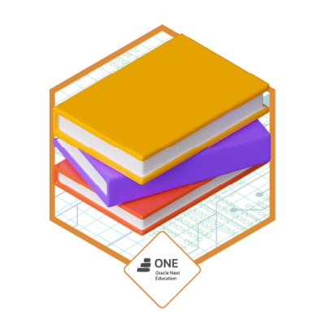

# 📚 Literalura - Catálogo de Libros

<p align="center">
  <a href="https://www.java.com/">
    
  </a>
  <a href="https://spring.io/">
    
  </a>
  <a href="https://www.postgresql.org/">
    
  </a>
  <a href="https://maven.apache.org/">
    
  </a>
</p>

**Literalura** es una aplicación de línea de comandos desarrollada en Spring Boot que permite interactuar con la API pública de [Gutendex](https://gutendex.com/). Los usuarios pueden buscar libros, registrar resultados en una base de datos PostgreSQL y analizar datos de autores y obras literarias.

## 🌟 Características

- Búsqueda avanzada de libros por título
- Registro de libros en PostgreSQL
- Gestión de información de autores (nombre, fechas de nacimiento y defunción)
- Filtrado de libros por idioma (Inglés, Español, Francés, Portugués, etc.)
- Consulta de autores vivos en un año específico
- Top 10 libros más descargados
- Estadísticas por idioma y descargas
- Interfaz de línea de comandos (CLI) intuitiva

## 💻 Requisitos del sistema

- Java 17 o superior
- PostgreSQL 15 o superior (o vía Docker)
- Maven 3.8+
- Conexión a Internet (para consultar la API de Gutendex)

## ⚙️ Configuración incial

### 1. Clonar repositorio:

```
git clone https://github.com/tu-usuario/Literalura.git
cd Literalura
```

### 2. Crear la base de datos MySQL

```sql
CREATE DATABASE literalura;
```

### 3. Configurar las credenciales de conexión

Crear `src/main/resources/application.properties`:

```properties
# Configuracion de PostgreSQL
spring.datasource.url=jdbc:postgresql://localhost:5432/literalura
spring.datasource.username=tu_usuario
spring.datasource.password=tu_contraseña
spring.datasource.driver-class-name=org.postgresql.Driver

# Configuracion de JPA/Hibernate
spring.jpa.hibernate.ddl-auto=update
spring.jpa.show-sql=true
spring.jpa.properties.hibernate.dialect=org.hibernate.dialect.PostgreSQLDialect
spring.jpa.properties.hibernate.format_sql=true

# Puerto
server.port=8080
```

### 4. Ejecutar aplicación
```
mvn clean install
mvn spring-boot:run
```

## 🚀  Uso de la aplicación

Al iniciar, se muestra un menú interactivo con las siguientes opciones:

```text
=== MENÚ PRINCIPAL ===
1. Buscar libro por título
2. Listar todos los libros
3. Listar libros por idioma
4. Listar autores vivos en un año
5. Mostrar estadísticas por idioma
6. Top 10 libros más descargados
7. Buscar autor por nombre
0. Salir
```

## 📚  Ejemplo de flujo

```
Buscar libro:

Ingrese título: "Don Quijote"

La aplicación consulta la API y guarda resultados

Ver estadísticas:

Muestra conteo por idiomas

Consultar autores:

Buscar autores vivos en 1850
```

## 🗂️ Estructura del proyecto

```
src/main/java/com/gutendex/gutendex_catalog/
├── config/              # Configuraciones
├── controller/          # Lógica de CLI
├── dto/                 # Objetos para la API
│   ├── AutorDTO.java
│   ├── LibroDTO.java
│   └── ResultDTO.java
├── model/              # Entidades JPA (Libro, Autor)
│   ├── Autor.java
│   └── Libro.java
├── repository/         # Repositorios
│   ├── AutorRepository.java
│   └── LibroRepository.java
├── service/            # Servicios (API y DB)
│   ├── ApiService.java
│   └── DatabaseService.java
└── GutendexApplication.java # Main
```

## 🧩 Tecnologías utilizadas

- **Java 17**: Lenguaje principal del proyecto
- **Spring Boot 3.1**: Framework para desarrollo rápido
- **Spring Data JPA**: Acceso a datos con repositorios
- **PostgreSQL 15**: Base de datos relacional
- **Jackson**: Serialización y deserialización de JSON
- **Maven**: Gestión de dependencias y ciclo de vida del proyecto

## 📄 Licencia

MIT License – Ver LICENSE para detalles completos.

Nota: Proyecto desarrollado con fines educativos y demostrativos.

## ⭐ Insignia de logro

Insignia de logro por completar el challenge **Practicando Spring Boot: Challenge Literalura**

<p align="center">
  
</p>
